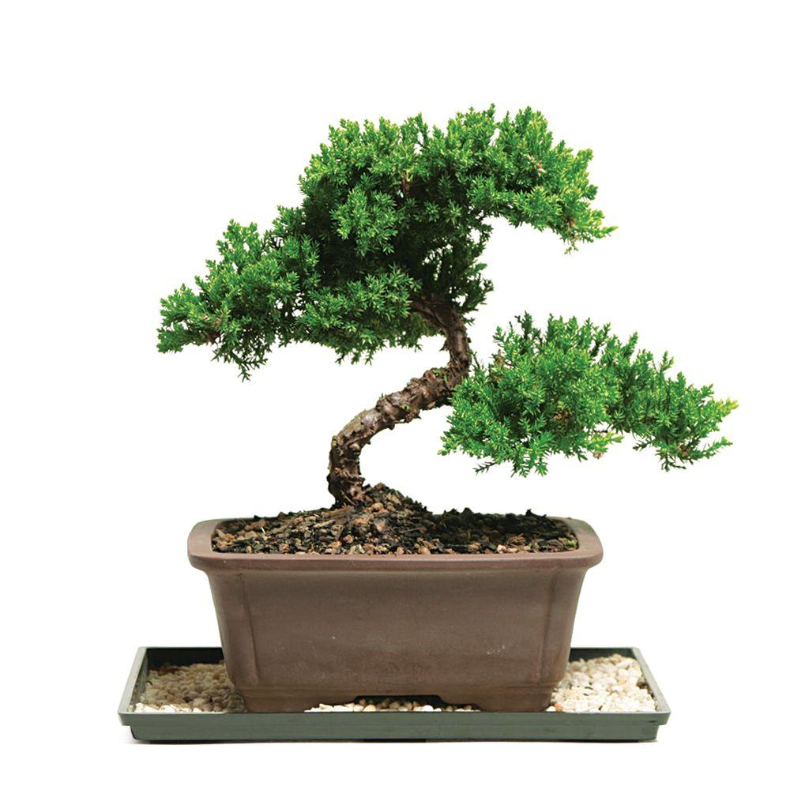
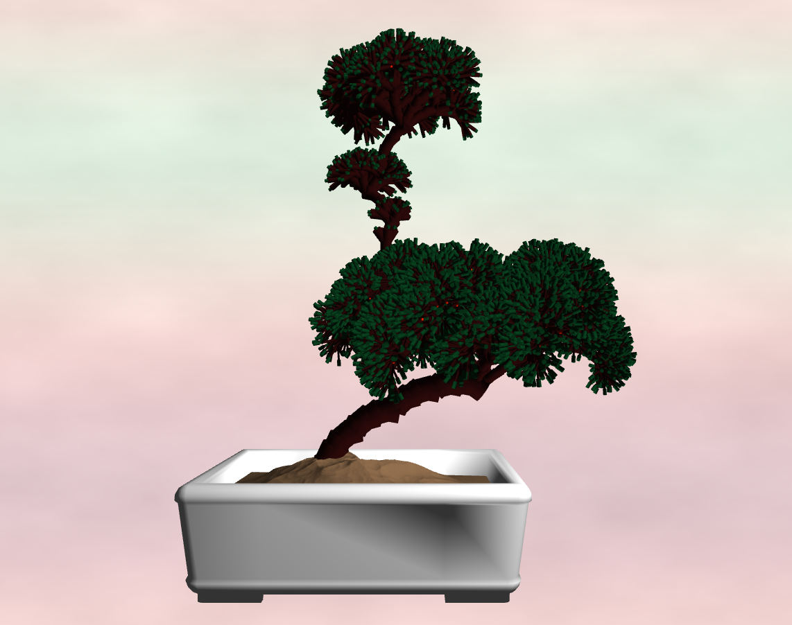
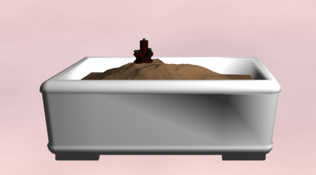
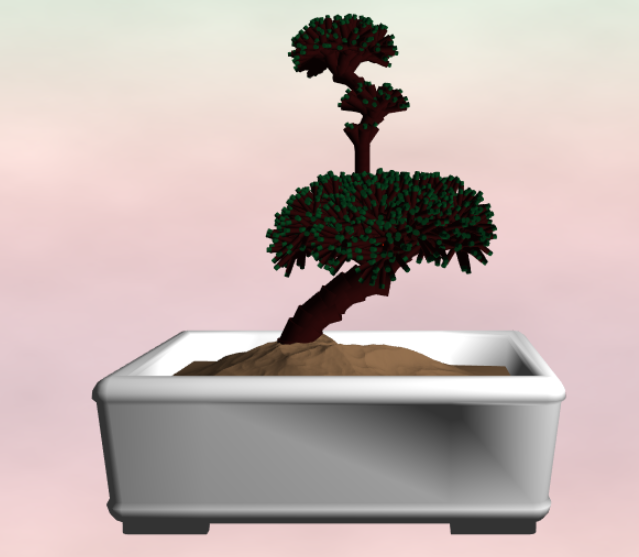
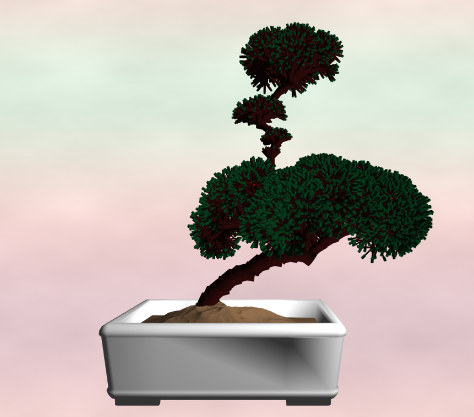

# Homework 4: L-systems

Jason Wang (jasonwa)

Scene Motivation:

Demo: https://jwang5675.github.io/hw04-l-systems/

## Resources
- https://cis700-procedural-graphics.github.io/files/lsystems_1_31_17.pdf
- http://algorithmicbotany.org/papers/abop/abop-ch1.pdf
- https://iquilezles.org/www/articles/palettes/palettes.htm

## Implemented Features
- ExpansionRules Class: This class represents the specific expansions rules for a given character. It contains an expansionRules map (string, function) that expands out an axiom for a given number of iterations. Specifically, expandAxiom(iterations: number) returns the expanded string axiom after x iterations given.
- Turtle Class: This class represents the turtle used to draw out the L-system. Each turtle contains a position vector (representing drawing point), a forward vector (representing the direction the turtle moves), a up vector (for orientation purposes), a right vector (for orientation purposes), and a quaternion (describing the current rotation of the turtle). The turtle also has a recursion depth parameter used to help draw the thickness of tree branches. The turtle has specific functions (moveForward, drawLeaf, drawFruit, rotation1....) that is called from the drawing rules map for the L-system as a call back function to move the turtle along a given axiom string. The turtle will return a matrix representing a transformation (Translation * Rotation * Scale) if the turtle moved or not that is used to pass transformation data to the VBO for instanced rendering. Turtles can also spawn another turtle (createTurtleInstance())to add to the turtle stack and copy an existing turtle to revert back to a previous position in time (setTurtleInstance(turtle: Turtle)).
- DrawingRules Class: This class represents the specific drawing rules given a character in an axiom. It contains a turtle, a turtle stack, and a map of rules(string, turtle.function) to move the turtle according to some axiom. The draw() specifically takes in a string representing an axiom and returns all the transformation data that the turtle used to draw such an axiom using the drawingRules map specified within the class.
- LSystem Class: This classes uses the DrawingRules class and the ExpansionRules class to return VBO formatted data describing the transformations and shapes of our L-System. Calling getVBOData(iterations: number) returns an array of data objects where data contains a field shape and matrix/color data for the specific shape.

- Instance Rendering: The L-System scene is rendered with instance rendering. I pass in 4 vec4 representing a single mat4 matrix (Translation * Rotation * Scale) to the GPU to render a shape. The mesh class is setup such that all vertices are passed into the GPU for a single mat4 (actually 4 vec4s, later creating a mat4) transformation. 

- Bonsai Tree L-System:
  - Initial Axiom: "F*XBL"
  - Grammar:
    - F -> F-F+ ("forward expansion", represents the tree growing forward with a bend to the shape)
    - X -> \[ 1 ~ F X L \] \[ 2 ~ F X L \] \[ 3 ~ F X L \] \[ 4 ~ F X L \] \[ 5 ~ F X L \] \[ ~ F X L \] ("recursive expansion", represents the tree splitting into 6 branches)
    - B -> FBF*X ("branch upward expansion", represents the tree growing up towards the y axis)
    - L -> (1-P)% Q, P% L ("fruit expansion", basically gives a small probability p based on the input randomness to evolve a leaf into a fruit)
  - Grows in 3D:
    - The tree grows in 3-d, the basic outline of the symbols work as follows:
    - F,X,B moves the turtle forward and draws a branch
    - L,Q moves the turtle forward and draws a leaf or a fruit
    - -,+ rotates the turtle by the local up axis with by a STATIC amount, mainly used to bend the truck of the trees into a curve
    - ~,* rotates the turtle by the local right and forward axis respectively by a STATIC + RANDOM offset based on the user input randomness
    - Iteration 0:
    - 
    - Iteration 1:
    - 
    - Iteration 2:
    - 
    - Iteration 3:
    - 
    - Iteration 4:
    - 
    - Iteration 5:
    - 
  - Contains leaves and small fruits (probability)
    - There is a small probability that the leaves evolve into fruits:
    - High probability of fruits (high randomness):
    - 
    - Low Probability of fruits (low randomness):
    - 
  - The randomness in the bonsai tree is from the turtle rotations and the chance of spawning fruit
  - Going with a very simple aesthetic to match the bonsai tree, the background is made by mixing a small amount of FBM and a light IQ cosine pallet based background. This makes a light background gradient with some fbm noise to make the background not as uniform and more 3 dimensional. 
  - Rotations creates curved forms with the branches

- GUI Elements
  - Iterations: This allows the user to specify different levels of iterations of the L-system to see how the bonsai tree grows.
  - Bark Color: This allows the user to change the color of the bark
    - Original
    - 
    - New Bark Color
    - 
  - Leaf Color: This allows the user to change the color of the leaves
    - Original
    - 
    - New Leaf Color
    - 
  - Randomness: This allows the user to change the randomness of the bonsai tree and how often to spawn fruits
    - High probability of fruits (high randomness):
    - 
    - Low Probability of fruits (low randomness):
    - 
